<div align="center">
  <h1>AtharvaAI</h1>
  <p>AI-based cultural knowledge comparison system for comparing old Vedic Age scriptures with reference to the Indian Constitutional Laws.</p>
</div>

<br>

## Landing Page

<div align="center">
  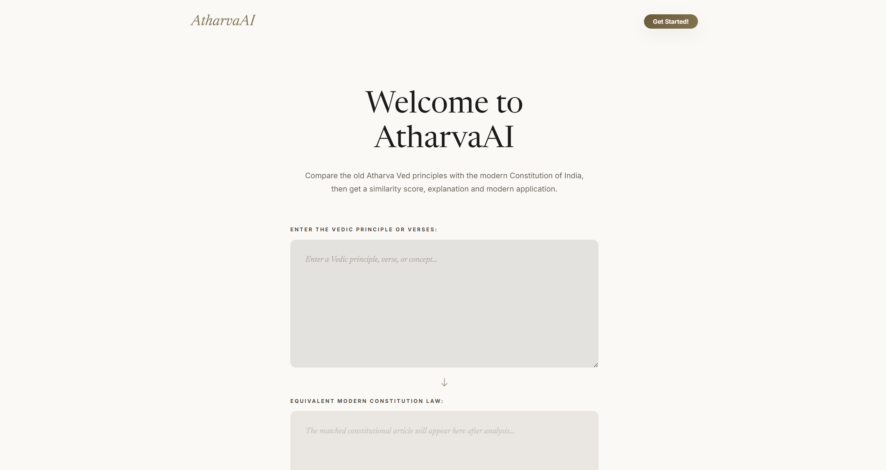
</div>

<br>

## Problem Statement

Develop an AI powered platform to analyze and compare Atharva Vedic principles with modern Indian constitutional laws, 
highlighting similarities and applications.

<br>

## About

Ancient Vedic philosophy and modern constitutional law often express similar ideas through very different language, structure, and context. That makes manual comparison slow and subjective, especially when trying to connect moral principles, duties, rights, equality, fairness, and environmental responsibility across two very different knowledge systems.

AtharvaAI acts as an AI-based semantic bridge. It helps identify the most relevant constitutional article for a Vedic principle, then explains the relationship in a structured way that is easier to understand, evaluate, and present.

<br>

## Features

- Curated backend with a predefined constitutional dataset for comparison.
- Pre-defined prompt system through suggestion cards for quick analysis templates.
- Fine-tuned matching flow using preprocessing, keyword boosting, and TF-IDF similarity.
- Hybrid AI pipeline that combines deterministic retrieval with Gemini-generated explanation.
- Structured AI output in JSON format for reliable frontend rendering.
- Real-time similarity scoring with confidence classification.
- Graceful fallback behavior when AI parsing or generation fails.

<br>

## Tech Stack

| Layer      | Technologies                                                        |
| ---------- | ------------------------------------------------------------------- |
| Frontend   | HTML, CSS, JavaScript                                               |
| Backend    | Python, Flask                                                       |
| Libraries  | scikit-learn, numpy, flask-cors, python-dotenv, google-generativeai |
| Deployment | Vercel (Frontend), Localhost (Backend)                              |

<br>

## Project Structure

```
AtharvaAI/
├── backend/
│   ├── ai_helper.py
│   ├── app.py
│   ├── matcher.py
│   ├── requirements.txt
│   ├── test_matcher.py
│   ├── test_models.py
│   └── data/
│       └── constitution.json
├── docs/
│   └── atharva-ai_system_architecture.svg
|   └── project-paper.pdf
|
├── Examples/
│   ├── Low_Score/
│   │   ├── analytical-synthesis.png
│   │   ├── detailed-synthesis.png
│   │   ├── foundation.png
│   │   ├── main.png
│   │   ├── practical-application.png
│   │   └── similarity-index.png
│   └── Perfect_Score/
│       ├── analytical-context.png
│       ├── detailed-synthesis.png
│       ├── foundation.png
│       ├── main.png
│       ├── practical-applications.png
│       └── similarity-index.png
|
├── frontend/
│   ├── app.js
│   ├── index.html
│   ├── style.css
│   └── assets/
│       ├── dharma-wheel.svg
│       ├── environmental-stewardship.svg
│       ├── github-logo.svg
│       └── justice.svg
|
├── Landing-Page.png
├── LICENSE
├── README.md
└── .gitignore
```

<br>

## Architecture Diagram

<div align="center">
	
</div>

<br>

## Results

Here are the two cases of example to show the project has worked so far:

### 1. Low Similarity Case

<div align="center">
	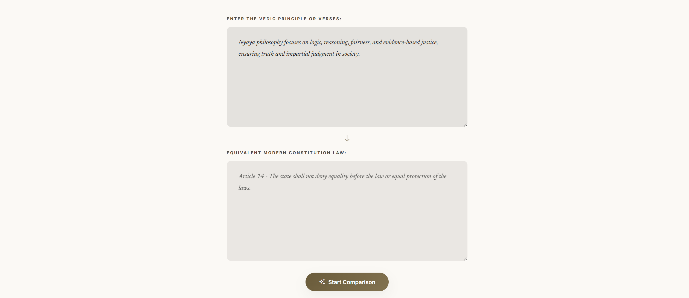
	<br />
	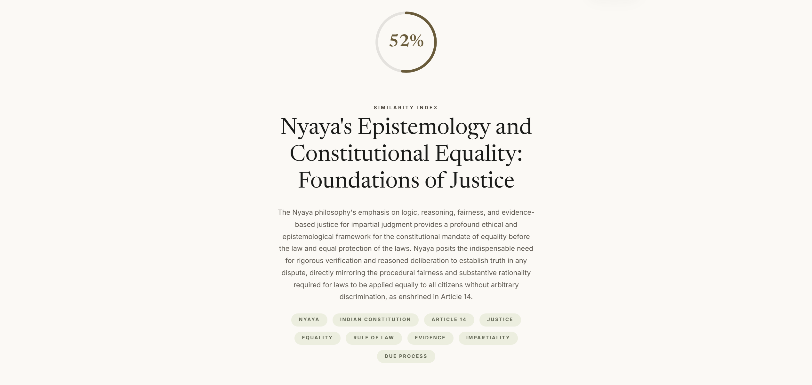
	<br />
	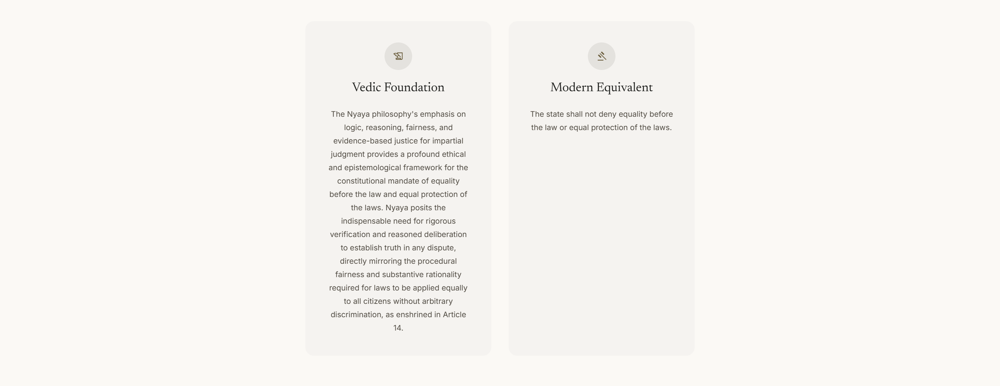
	<br />
	
	<br />
	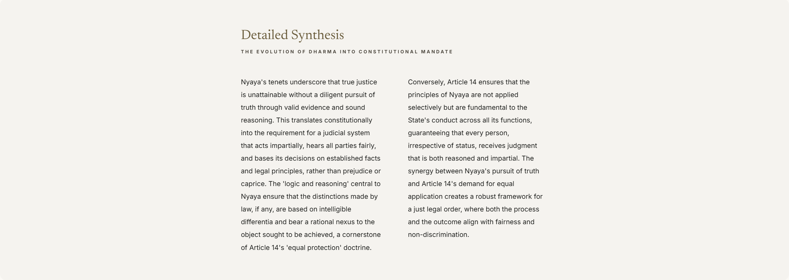
	<br />
	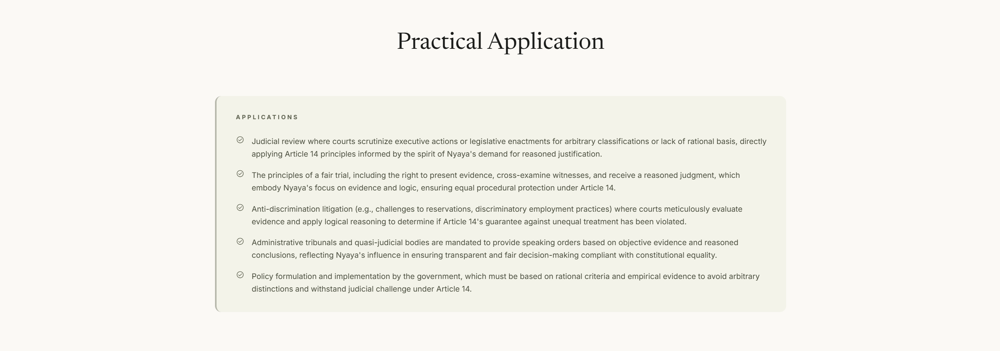
</div>

### Why did a Low Similarity Score occur?

A low similarity score does **not indicate an incorrect match**, but rather reflects the difference between **conceptual alignment and lexical similarity**.

The matching engine in AtharvaAI is based on **TF-IDF vectorization and cosine similarity**, which primarily relies on **word overlap and frequency patterns**. When the user input and the constitutional article express similar ideas using **different vocabulary or abstract phrasing**, the system detects weaker textual similarity.

For example:

* The input may discuss **justice, power, or moral responsibility**
* The matched article (e.g., Article 14) may use terms like **equality before law and equal protection**

Although both convey related philosophical meaning, the **lack of direct keyword overlap reduces the similarity score**.

Additionally:

* Synonym preprocessing helps partially bridge this gap
* Keyword boosting improves relevance
* However, the system still maintains **honest scoring rather than artificially inflating similarity**

This results in a **moderate or low score despite a correct conceptual match**, highlighting the system’s transparency and interpretability.

<br>

### 2. High Similarity Case

<div align="center">
	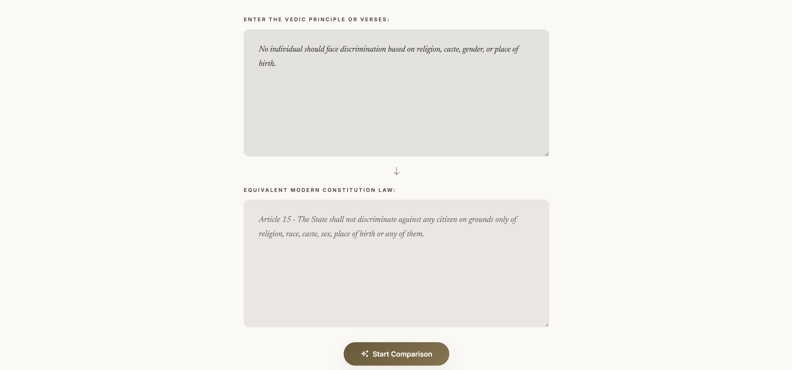
	<br />
	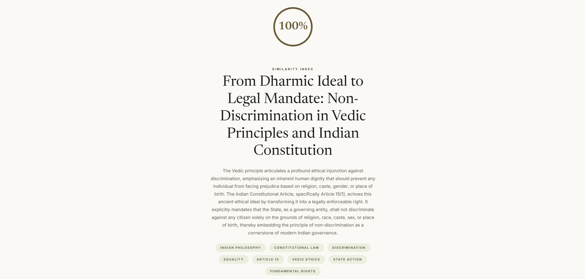
	<br />
	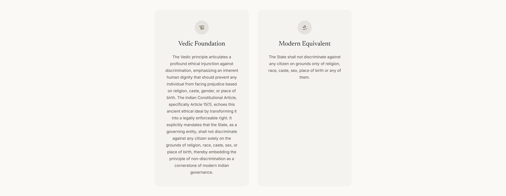
	<br />
	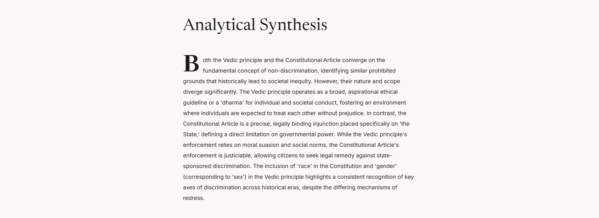
	<br />
	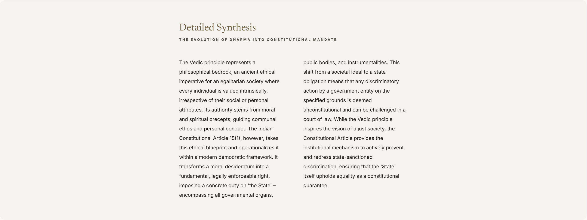
	<br />
	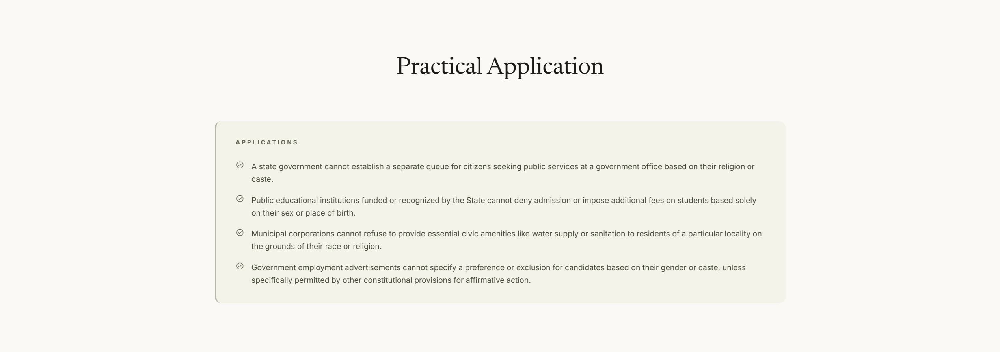
</div>

### Why did a High Similarity Score occur?

A high similarity score occurs when there is strong **lexical and semantic alignment** between the input text and the matched constitutional article.

In AtharvaAI, the matching process combines:

* **TF-IDF vectorization**
* **Cosine similarity**
* **Keyword boosting**
* **Synonym preprocessing**

When the user input contains terms that closely match the article’s language — such as:

* "equality", "fairness", "non-discrimination"
* "rights", "law", "justice"

the system identifies a high degree of overlap in both **word frequency and contextual meaning**.

This results in:

* Strong vector similarity
* Reinforced scoring through keyword weighting
* Boosted relevance via domain-specific rules

Because of this alignment, the similarity score increases significantly, often falling in the **70%–90% range** or even **100% range**, indicating both:

* **Textual similarity (word-level match)**
* **Conceptual similarity (meaning-level match)**

This reflects the system’s ability to accurately recognize and prioritize closely aligned inputs.

<br>

## API Endpoint

### `POST /compare`

Request:

```json
{
  "text": "vedic principle"
}
```

Response fields:

- `article`
- `similarity_score`
- `confidence`
- `ai_analysis`

The backend first finds the best constitutional match using TF-IDF and keyword boosting, then passes the selected article and user input to Gemini for structured analysis.

<br>

## How to Run Locally

1. Clone the repository.
2. Install Python dependencies from `backend/requirements.txt`.
3. Run the Flask backend server from the `backend/` folder.
4. Open the frontend from the `frontend/` folder in your browser.

Example:

```bash
cd backend
pip install -r requirements.txt
python app.py
```

<br>

## Live Demo

<https://atharva-ai-tau.vercel.app/>

<br>

## Credits

- Favicons for icons.
- Material You and Google design inspiration.
- Google Fonts.
- Gemini API (Model 2.5).

<br>

## Personal Journal

OK DAMN, This has to be one of the craziest speedrun I have done. While down with heatstroke and a holiday in mind, I finally decided
to touch this project assignment for a 0 credit subject "Indian Knowledge System". 

To be Honest, I never thought I would work so hard on this
one, but then again when ADHD brain hits and finds a concentration point of hope then one can code for 10 hours straight :O. Of course, I took some breaks
in between too, but then again, the breaks were nominal. From being a 0 credit project, it became some what resume additive material. Still not that stronk QwQ.

Starting with the dilemmas, oooof, what do I even say about the project; It was a massive headache to actually get a perfect output. A lot of finetuning went into the ``matcher.py`` specially the part where synonyms were present, there was this one instance where I was getting a similarity index of 14% for a comparision where it should be 100% logically :/. Another instance showed me 110% similarity and that's why there is a Similarity Cap present.

This was my first venture into API endpoint system and json finetuning using python along with full stack system using python and javascript and oh well I'd say for the past 10 hours, I learnt a lot of new stuff and I really enjoyed it. Looking forward to more silly projects like these!

Do checkout the Project Paper I wrote using Overleaf and Prism Editor! Definitely worth a read.

<br>

## Show Your Support!

If you like this project, please give it a ⭐ on GitHub!

<br>

## Thank You

Feel free to support me on the respective platforms, most of them are still a work in progress for uploading and building Portfolio :D.

- **GitHub**: [@anirxddh](https://github.com/anirxddh)
- **LinkedIn**: [Aniruddha Dey](https://www.linkedin.com/in/aniruddha-dey/)
- **X**: [Aniruddha Dey](https://x.com/anirxddh)
- **Behance**: [Aniruddha Dey](https://www.behance.net/anirxddh)
- **Dribble**: [Aniruddha Dey](https://dribbble.com/anirxddh)

<br>

<div align="center">

### Made with ☕ by Aniruddha Dey.

</div>